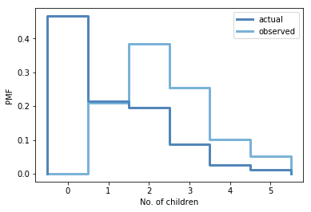

[Think Stats Chapter 3 Exercise 1](http://greenteapress.com/thinkstats2/html/thinkstats2004.html#toc31) (actual vs. biased)

>>
**Code**

unbiased_dist = thinkstats2.Pmf(resp.numkdhh, label='actual')

biased_dist = BiasPmf(unbiased_dist, label='observed')

thinkplot.PrePlot(2)

thinkplot.Pmfs([unbiased_dist, biased_dist])

thinkplot.Config(xlabel='No. of children', ylabel='PMF')

**Answer**

Mean (Actual)  : 1.0242051550438309

Mean (Biased)  : 2.4036791006642821

